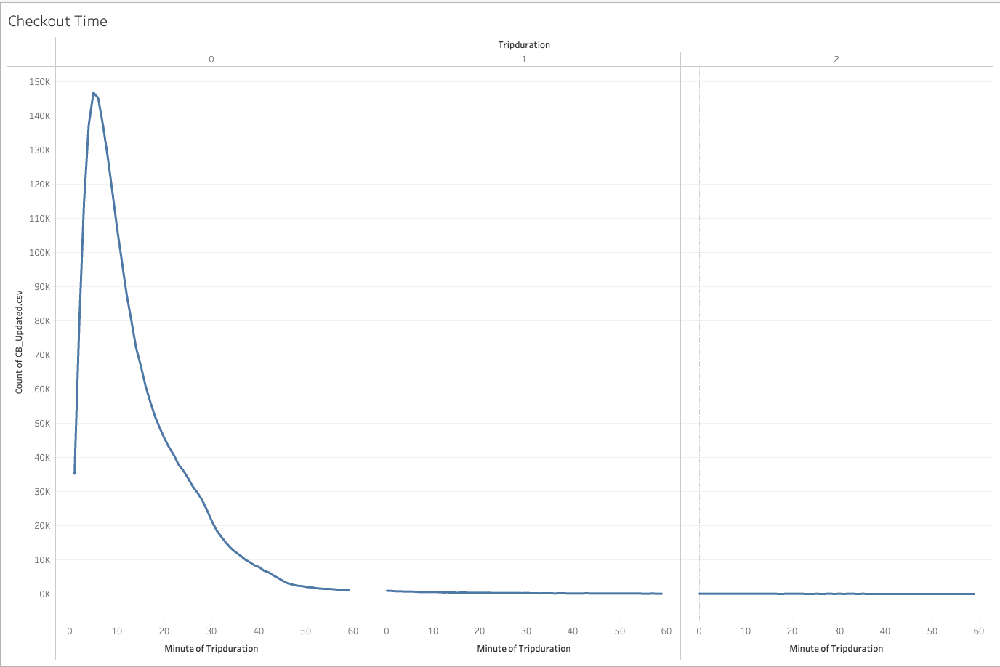
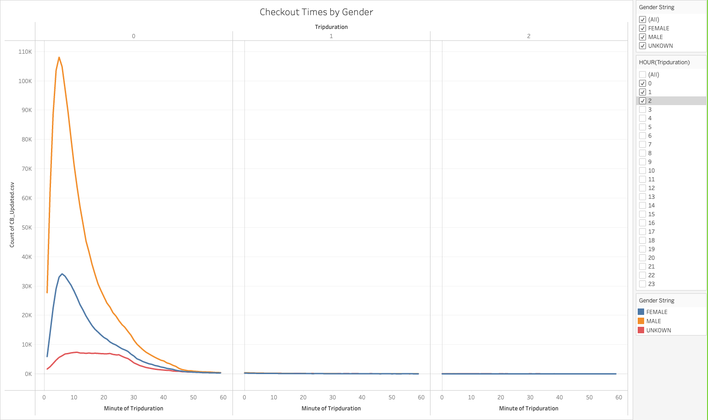
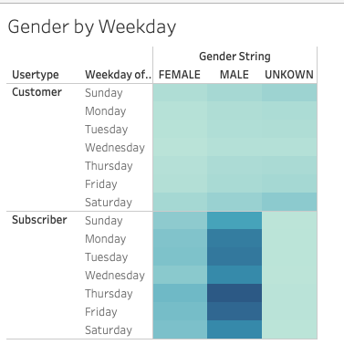
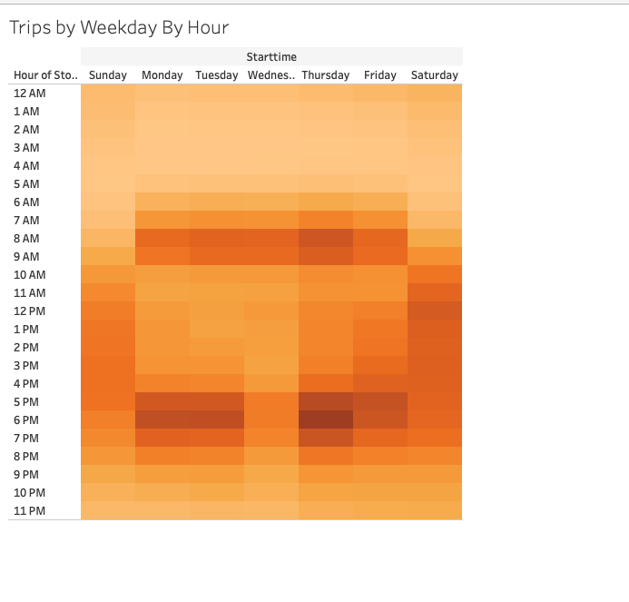
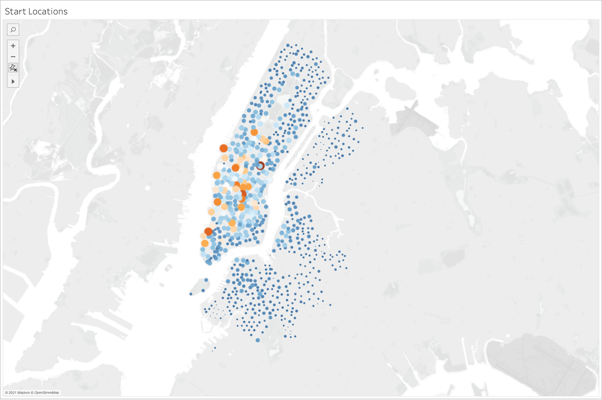
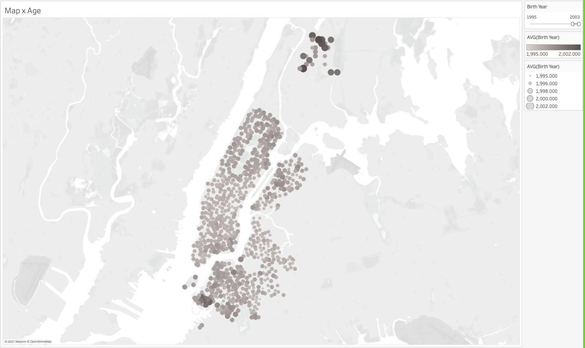
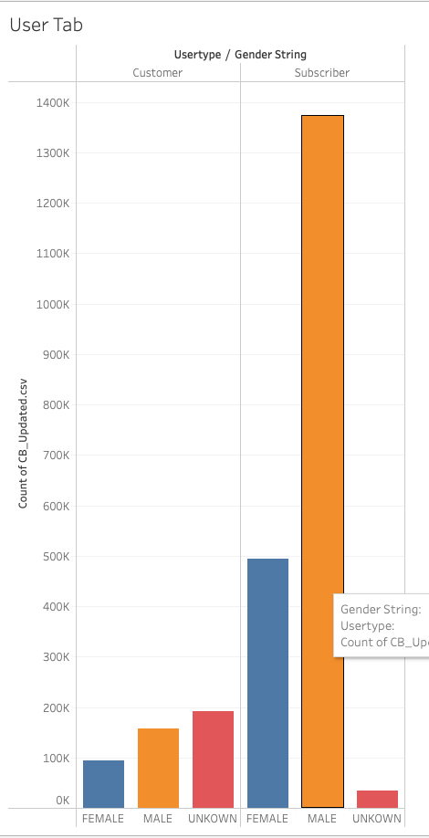

# Bikesharing

## Link to Story
[Link to Dashboard](https://public.tableau.com/app/profile/griffin.o.mccalla/viz/CitiBikeChallenge_16374657923330/Story1?publish=yes)

## Overview of Analysis
* 
 This project's purpose was to analyize the data collected from CitiBikes NYC bikes. 

## Results

* 
 This chart shows that the majority of people ride a CitiBike for ~10 minutes.

* 
 This chart shows that the majority of people ride a CitiBike for ~10 minutes.

* 
 Here you can see that the male subscribing customers the most frequent customers.

* 
 Here you can see that the most popular hours are 7am to 9am and then 5pm to 7pm. Also popular times were spread out through out the day on the weekends.

* 
 Here is a map of the NYC area. The larger and hotter the circle, the more riders at that time.

* 
 Here is a map of the NYC area. You can see that the majority of younger people are riding in the upper.

* 
 Here you can see that the majority of the CitiBike riders are male subscribers.

## Summary
* 
Business is booming, and the peak times are when people are commuting or floating around on the weekend. The main source of rides froms from male subscribers
